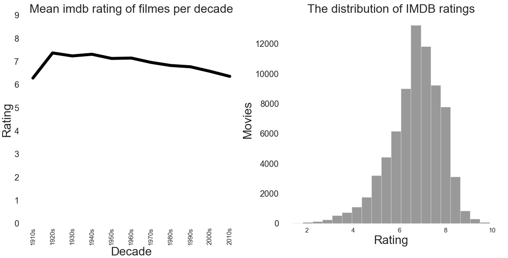
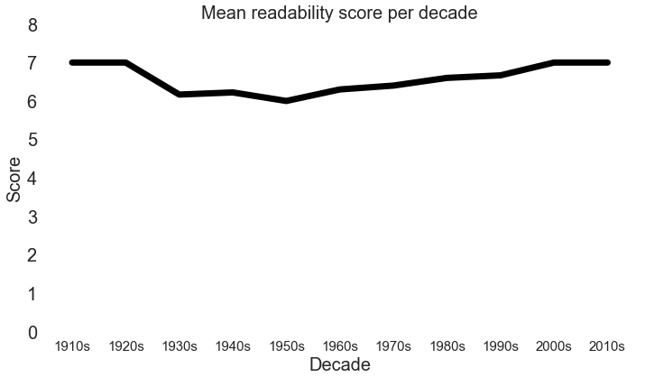
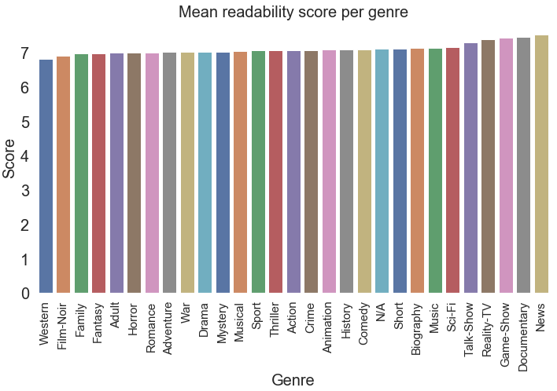
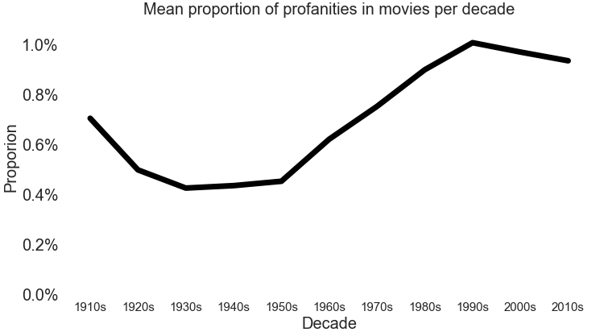
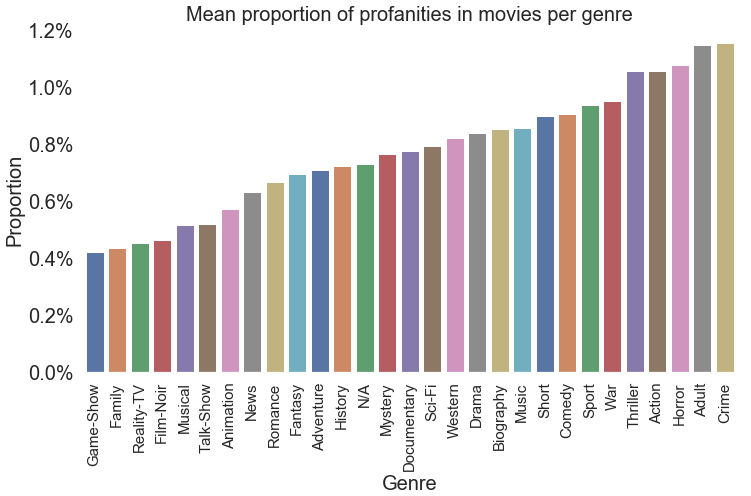
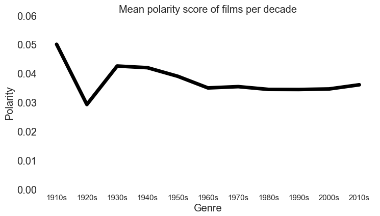
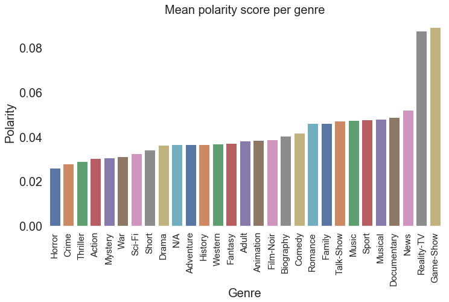
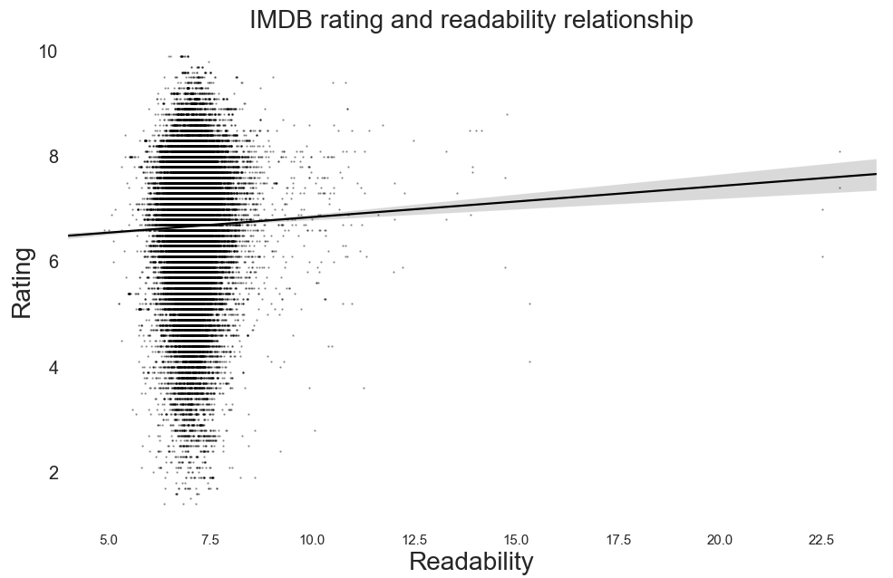
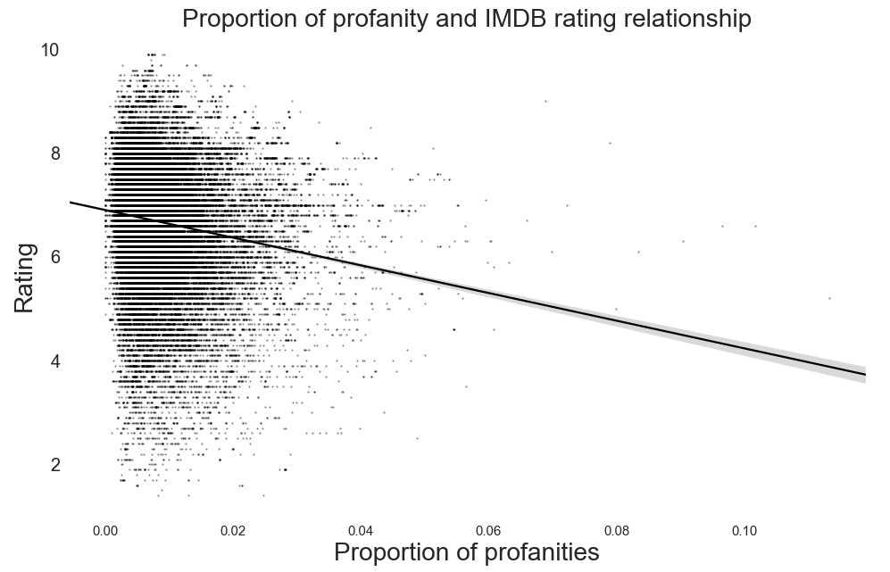
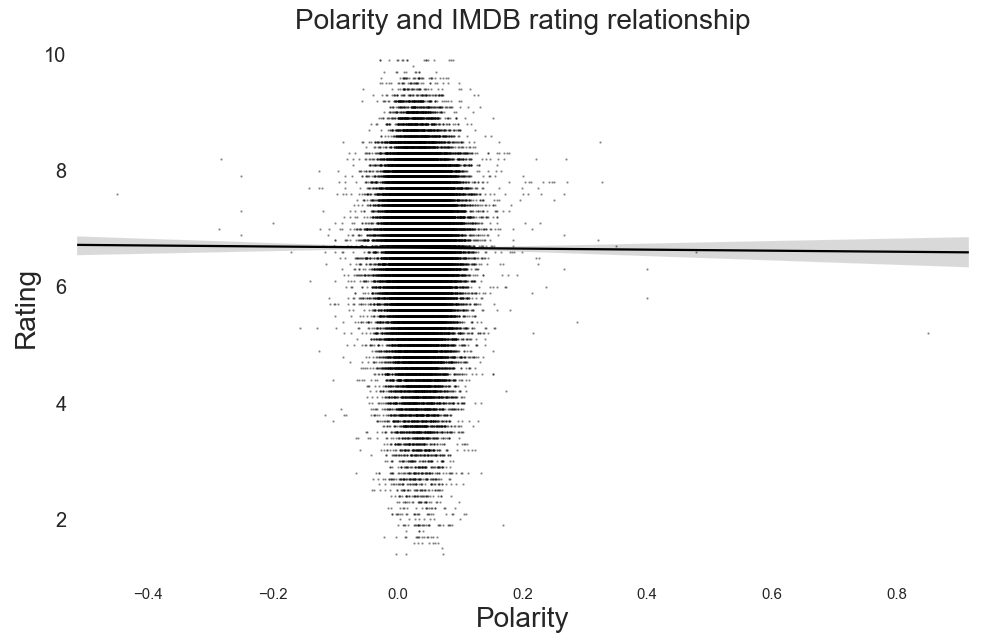

__write and intro here__

#### First analysis title

Before starting the analysis, it is important to give some main facts about our dataset. If the data is bad - the conclusion will be bad, so we will try to see why our data can lead to a certain bias.

As you can see on the left plot above, we mostly have new films in our dataset. Every time we do an analysis of some film property by decade, you must know that the conclusions will be more grounded for the last two-three decades than anything before that. There were simply less films produced back then.

The right plot above shows a distribution of genres in our dataset. For some genres, such as drama, comedy or action we have a lot of data. But for some more specific genres such as musical or Western we don't have that many films, so when we do analysis by genre you should be aware that conclusions for those genres might be biased (due to small sample size). 

On the plots above we can see some statistics about IMDB ratings of our movies. It seems that old movies were rated a bit better than new ones, and the trend seems to go toward lower ratings.
While it's possible that a higher proportion of new films are of lower quality, it could also be a bias in our dataset: nobody uploads subtitles for old movies of low quality on the OpenSubtitles website. 

As can be seen on the right plot, IMDB ratings are approximately normally distributed with a mean of 6.5. Getting a film to score over 9 might be harder than winning an Oscar!

### The Lowest Common Denominator

Films are generally expensive to make, and are primarily made for profit. But how can your movie sell if most people don't understand it? Your film might be a stroke of genius, but general audience might be more interested in toilet humor than your intellectual rambling. Many cinemaphiles claim this is the reason why most movies are "dumbed-down", and this phenomenon is generally known as the [lowest common denominator](https://tvtropes.org/pmwiki/pmwiki.php/Main/LowestCommonDenominator). 

Quantifying complexity of a film is a difficult task. What does it mean for a film to be complex? Longer sentences? More "smart" words? We decided to use an already existing metric to quantify complexity of our films. The [Dale-Chall readability formula](https://en.wikipedia.org/wiki/Dale%E2%80%93Chall_readability_formula) measures how readable a text is. Larger score means that the text is less readable. Considering that readability in Dale-Chall formula is calculated by measuring the number of difficult words and the length of the sentences, __we will assume that readability is a good proxy for complexity__. In other words, less readable text should be more complex.

Looking at the plot above, it seems that readability is pretty much constant in time. All decades score between 6 and 7, which  means that the typical film can be "easily understood by an average 7th or 8th-grade student" (according to the interpretation table attached to the Dale-Chall formula). 

It seems that readability is also constant through genres. There are some slight variations (documentary and news being least readable, Westerns being most readable) but they are really minor. 

However, we cannot make a definite conclusion that films have almost constant complexity per decade and per genre. Our chosen measure, the Dale-Chall formula, was designed for written text, and not for spoken language used in movies. It could be that spoken language, which usually has shorter sentences and uses simpler words, is just inherently more readable / less complex than written text.

### The F-bombs

Scorsese's _The Wolf of Wall Street_ broke the all-time record for number of f-words in a movie: the word was used a whooping 506 times. That is more than 9 f-words used every minute! However, this is just one example. Are newer films in general containing more and more offensive language? Using our movie data and [this](https://github.com/zacanger/profane-words/blob/master/words.json) list of profanities, we will answer this question.

We can observe several interesting things in the above plot. From early 30s until the late 50s Hollywood movies were highly censored under the set of moral guidelines called [the Hays code](https://en.wikipedia.org/wiki/Motion_Picture_Production_Code). The uncensored era before the code is known as [pre-code Hollywood](https://en.wikipedia.org/wiki/Pre-Code_Hollywood) era. We can spot both the pre-code era and the Hays code era on the plot: the proportion of profanities is high in the 1910s and 20s, but decreases in the 30s and only starts to increase in the 60s. 

Another thing we can see is that the proportion of profanities in an average new movie has more than doubled from the mid-20th century. The 90s were a particularly profane decade: 1 out of every 100 words in a movie was a swear word. We now know that newer movies are full of profanities, but which genres lead the way?

As expected, crime, adult, horror and action movies have the highest proportion of profanities. On the other hand, game-shows and family movies are more mild. One would imagine the imbalance in genres would be even bigger: it's hard to imagine that a family movie has any profanities at all. This is probably due to many false positives in our list of profanities: a lot of them are ethnic and racial designations that are only offensive in a certain context ('whites' and 'blacks' can refer to laundry, for example). 

### And They Lived Happily Ever After

Earth was saved from the alien threat, the cavalry has arrived, the hero got the girl, and the couple finally got together after they realized all of their differences were just misunderstandings. Films in general often have a positive tone and a happy ending; after all, people have enough sadness in their real life. But too many happy endings and they can become annoying, and some even say [unhealthy](https://www.gamesradar.com/happy-endings-to-movies-are-secretly-unhealthy-but-we-keep-falling-for-them-hook-line-and-sinker/). We will check if it is truly a fact that we have more happy movies today, and also find out which genres to avoid if you desire some realism.

Measuring the sentiment of a film is not an easy task. We used [TextBlob](https://textblob.readthedocs.io/en/dev/index.html) and their implementation of sentiment analysis to calculate polarity scores for each of our movies. Positive score implies positive sentiment, while negative score implies negative.

Except some slight variations in early 20th century (which can be explained by small sample sizes for those decades) the sentiment of films seems to be quite constant. An interesting thing to notice is that the sentiment is generally positive - movies are not getting more positive, they were positive from the beginning.

Unsurprisingly, game-shows and reality-TV are in general positive and horror, crime and thriller are negative. It is interesting to notice that documentaries and news-shows have one of the most positive sentiments - and they are mostly talking about the real world. Either they are focusing on happy stories or our world is not so bad as it sometimes seems.

### How to Make a Blockbuster

You now know that films are pretty readable, that swear words will soon become more common than non-swear words, and that horrors are not so happy. But what is the worth of knowledge if you can't use it to make some money? In this section, we will look at the three film properties that we have already analyzed (complexity, proportion of offensive words, sentiment) and try to find correlation between them and movie ratings. 

There seems to be __no correlation__ between the readability (as defined by the Dale-Chall formula) and IMDB ratings. The regression line is slightly positive, but this is due to a few outliers with high readability and ratings. One can say that making movies more or less readable is probably not going to affect the public perception.

Even though the regression line is negative, __there doesn't seem to be much of a correlation here__. The great majority of our films are situated in the blob on the left and it doesn't seem that there is any dependency between profanities and rating in that blob. Good movies can have a lot of swear words, bad movies can have a lot of swear words, and the opposite. 

For polarity, there is __absolutely no correlation__. People seem to like sad endings too. 

For studio executives out there, we have bad news: it is not a simple matter of increasing positive sentiment or number of profanities to get good ratings. Our data tells us that the quality of a movie is not simply explained by measuring complexity, sentiment or the number of profanities - it is something much more subtle, and at the end - subjective.

---

__Thank you for reading__. We hope you enjoyed our story. 

__Authors:__ Jakob Svenningsson and Robert Injac

Code used for making this data story is available [on GitHub](https://github.com/RobertInjac/ADA-Project-2018-OpenSubtitles).
