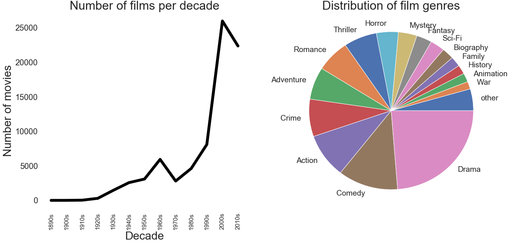

__This project describes the analysis to medical data in combination with data of a variety of possible influencing factors. Our goal is to extract usefull information from this data that could help improve societies quality of life. If we want the impact of our research to have the biggest postive influence possible, it follows naturally that it may be most interesting to look at the medical data from global point of view.__

##### Most common causses of death

There is endless amounts and different types of medical data out there, we want to select the data could potentially have the most significant impact on people's lives. quality of life is only significantly effected if the disease causes pain or limits the patient ablilities. The most severe effect of a disease is when it causes death, after all, you can't have any "quality of life" anymore if your life has come to an end.
Conclusion: If we want to have a big impact on society's quality of life it might be interesting to look at the diseases that cause the most deaths.

##### The Lowest Common Denominator

##### The F-bombs

##### And They Lived Happily Ever After

##### How to Make a Blockbuster

---

__Authors:__ Nathan Sennesael, Ruben Janssens, Aurelien Gabriel Debbas, Joakim Kattelus

The project was a part of the Applied Data Analysis (ADA) course at EPFL.  
Instruction: Robert West

Special thanks to:  
TA: Tiziano Piccardi 
AE: Yves Rychener 

Code used for making this data story is available [on GitHub](https://github.com/Senneschal/Data_Science_Alliance).
