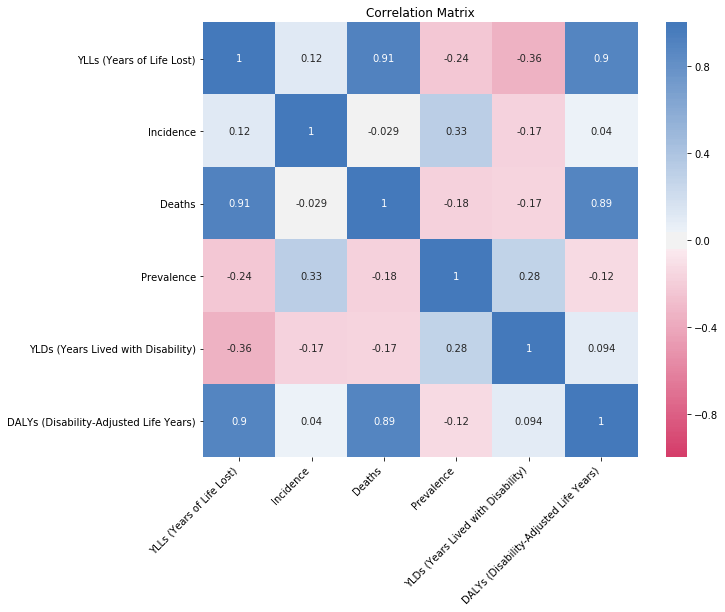

__All over the world, lots of data is gathered concerning people's health. Can we extract useful information from this data to improve the quality of life of societies? In this project, we specifically want to get to know which diseases have the biggest negative impact on societies' quality of life, and what factors influence this.__

For this analysis, data from the Global Burden of Diseases [dataset](http://ghdx.healthdata.org/gbd-results-tool) was used.

##### Impact of diseases

*Which diseases have the most significant negative impact on society's quality of life? How does this differ between countries and how does it change over time?*  

To answer this question, we first need to decide how we quantify the impact a disease has on quality of life of a society. The easiest way to look at this, is to look at the number of deaths a disease causes: after all, you can't have any "quality of life" anymore if your life has come to an end.  

So, let's start off by looking at which diseases caused the most deaths worldwide, in every year since 1990.



We find that cardiovascular disease and cancer are globally by far the most common causes of death, followed at a distance by cancers, with all other causes following at more of a distance behind cancer. Those two leading diseases have been steadily rising ever since 1990. Within the other diseases, we see that dementia and diabetes, blood and endocrine diseases have been rising as well, while other diseases like lower respiratory infections have been falling. 

However, the most common causes of death, and the way in which they changed, strongly vary between different countries. So, let's now compare the change in number of deaths from different diseases between all countries in the world. Because countries have different populations, we now look at which percentage of all deaths were caused by a specific disease. You can choose the disease yourself using the drop down menu. We then plot the difference between that percentage in 2017 and that in 1990: a positive value means that a disease represented more of the deaths in a country in 2017 than in 1990.



When looking at cardiovascular disease, we see that it has become increasingly prevelent in developing countries while its prevelence is decreasing in developed countries. Note that Syria is a clear outlier in the Middle East, this may very well be a result of war.

**ADD MORE ANALYSIS**

The Global Burden of Diseases dataset also contains a number of other interesting measures to see the impact of diseases on people's quality of life. Six measures are available: deaths, incidence, prevalence, Years of Life Lost, Years Lived with Disability and Disability-Adjusted Life Years. The following bar chart plots the diseases, sorted according to their value for a specific metric. You can choose the metric in the dropdown menu. After the chart, we explain what the different measures represent to get a more intuitive feeling for them.



* **Deaths** represent, of course, how many people actually die from these diseases. Since this is the most intuitive measure, let us compare the other measures with this.
* **YLLs (Years of Life Lost)** represent the years of life lost due to premature mortality. YLLs are the multiplication of
deaths and a standard life expectancy at the age of death. It generates a rather similar ranking to the deaths one. However, this clearly takes into account the age at which the person dies from this diseases: that explains why maternal and neonatal disorders is number three in this ranking, while it is not in the top 5 of deaths, because people die at a much earlier age from these disorders, leading to a higher number of years of life lost.
* **YLDs (Years Lived with Disability)** are the years lived with any short-term or long-term health loss, weighted for
severity. Its ranking shows mostly diseases from which people don't die (quickly), but which have a high impact on quality of life (disabilities which have a high impact are weighted higher in this measure), such as musculoskeletal disorders (such as paralysis).
* **DALYs (Disability-Adjusted Life Years)** is defined as the sum of the Years of Life Lost and Years Lived with Disability, leading to the 'number of healthy life years lost'. This can be seen in the ranking: it is a mix of diseases from which many people die, such as cardiovascular diseases and neoplasms (cancers), and diseases which have a long-lasting high impact on life (such as musculoskeletal diseases).
* **Incidence** is the number of people who contracted a certain disease in 2017. Here we see some diseases, like respiratory infections, skin and subcutaneous diseases and others, which are very common, but are quickly cured: so the people don't die from them and don't have to live with them for long, when comparing to the deaths ranking.
* **Prevalence** is the number of people who lived with that disease in 2017. This metric can be compared to the Years Lived with Disabilities, since they both emphasise diseases people live with for a long time, but this metric is not weighted by the impact of the disease on the quality of life, so diseases like Sense organ diseases (like hearing or vision impairment), which have a relatively lower impact than musculoskeletal diseases, are ranked higher.

Let's also look at the correlation between those metrics to see if we can infer more information or confirm the ideas we just formulated.

* **Deaths** and **YLLs** are strongly positively correlated. This shows that even though YLLs take into account how old a person is at time of death, this only slightly changes the ranking.
* **DALYS** are strongly positively correlated with YLLs (and as such also with Deaths), and only weakly positively correlated with YLDs. This means that apparently, the YLLs have a much higher impact on this value than the YLDs.
* Both **Prevalence** and **YLDs** are negatively correlated with Deaths. This affirms our conclusion from earlier that these measures emphasize diseases from which people don't always die, but just live with for a long time.
* Similarly, **Incidence** and **YLDs** are negatively correlated: showing that YLDs emphasise diseases that not many people get each year, but with which they do live for a long time.
* Also **Prevalence** and **Deaths** are negatively correlated, showing that diseases with high prevalence are diseases with which people live for a long time, but which don't always cause death.

All of these measures clearly have their own merit and provide different insights. However, since we want to explore the impact diseases have on society, the DALYs measure is probably the most interesting. We will primarily use this measure for all future analyses.

According to the DALYs, the four diseases with the biggest impact are cardiovascular diseases, maternal and neonatal disorders, neoplasms (cancers) and respiratory infections and tuberculosis. To finish this part, let's look at which countries are most affected by these diseases. The following map shows the DALYs lost per hundred thousand people, for the selected disease, in 2017.



When we compare this map for the four diseases we just selected, we can see that cardiovascular diseases and neoplasms cause the biggest impact in the developed world (with the former having an especially large impact on Eastern Europe), and maternal and neonatal diseases, together with respiratory infections and tuberculosis, have a bigger impact on the developing world. This geographical diversity makes analysing these four diseases more interesting.

In the next chapters, let us look at in which countries have a similar impact due to these diseases in the last 30 years, and at the different risk factors and economic factors that might lead to these diseases having a higher impact.

##### Clustering of countries

To compare how diseases develop in different countries, we took disease data from The Global Burden of Diseases dataset for each country and disease, and investigated which countries are correlated. There is several ways in which a disease can be strongly correlated between countries. Neighbouring countries may be strongly correlated because the disease could spread accross the borders. But also countries that are far apart from each other could be highly correlated as a result of frequent air travel between them. Another way distant countries could strongly correlated is because of past colonization, which may cause the populations to have similar genetics that makes them vulnerable to a specific disease, etc. We then grouped the countries for specific diseases such that in each groups are correlated with each other above a certain threshold value. 

The slider beneath the plots determines the "coarseness" of the grouping. It gives the average lack of positive correlation allowed within groups: a value of ***0*** means perfect correlation, ***1*** on average no correlation within group and values greater than one include even negatively correlated countries in the group. Thus if the slider is all the way to the right, almost every country is concidered to be in the same group while if the slides is moves all the way to the left, almost every country is concidered to be its own group.



This plot shows strong difference between the Western and Eastern world, especially in Europe. The border between groups defintely differentiates between what is commonly known as Western and Eastern Europe. Interestingly, we saw in the previous part that deaths of cardiovascular diseases are decreasing in the developed world and increasing in the developing one.
But looking at correlation of DALYs, much of the developed and developing world is grouped in the same group, implying similar development. This implies that while deaths from these diseases are decreasing in developed countries, people still live with them and suffer from them.

In general, the groups do not appear to be confined to geographical groupings. This supports the hypothesis that cardiovascular diseases may depend mainly on societal and economic factors.



For respiratory and tuberculosis, the correlation appears stronger, as larger groups form at lower grouping tresholds. The grouping also appears more dependent on geography as neighbouring countries quickly form groups, which strongly differs from the societal and economic factors that showed to govern cardiovascular disease. This makes sense, as this is now an infectious disease we are looking at, which can truly spread accros countries.

An interesting correlation that shows up is the strong correlation between Germany and Argentina. This could just be a coincidence, but there are strong historical ties between the countries and a lot of German expats/people with German roots living in Argentina. https://en.wikipedia.org/wiki/German_Argentine People may transfer the diseases from country to country when visiting relatives. We are also looking at a long term measure such as DALY's. One hypohesis that could be made is that German Argentines with dual citizenship might seek treatment in Germany, a country ranked higher in healthcare comparisons. However, more research would be needed to comfirm these speculations.



For infectious diseases, Incidence might be a better measure. Indeed, looking at Incidence as opposed to DALYs shows some fascinating things: the correlations are strong, indicating an infectious disease. At coarse grouping, the entire world except for a select few countries are positively correlated, while these countries actually appear quite negatively correlated to the bigger group. The interesting observation that can be made is that all these countries in their own separate groups are countries that have been subject to considerable instability, strife and even civil war in the time period considered. (Liberia, Chad, Afghanistan...) This may indicate that the disease incidence in conflict prone countries is simialr between these countries and very different and not positively correlated with the rest of the world. In essence, these countries may be "isolated", and not part of a global network of disease transmission. However, due to strife and instability, the medical data from these countries might just be incomplete or faulty.

Note that, the old adage "correlation does not imply causation" is very much applicable to these findings. That two countries are correlated only means that the development of the disease in the countries is similar. The reasons for this similarity may be many: direct spread of disease, geographical factors, social, economic factors and more. These reasons and risk factors for disease will be explored in the next sections. 

##### Economical and political factors

We saw in the first section that some causes of death were more significant than others. 
If we add the life expectancy and the GDP per capita, we notice that the suggestions we made previously are realistic.  
Indeed, we notice that cardiovascular diseases and apply precipitously to the most developed countries and to the richest countries while other causes of death apply more to the least developed countries.  
Cardiovascular diseases, Musculoskeletal disorders and Neoplasms are considered as diseases of more developed countries but  Maternal and neonatal disorders and Respiratory infections and tuberculosis are diseases that are more prevalent in less developed countries.   

The following graphs show these measures and the evolution of the countries over the years.  
We have also expressed the economic situation of the country by its GDP per capita, which is represented by the size of the spheres. Furthermore, the the region and geographical sub-region of the specific country is represented by the colour.







 



Also note that nuances exist for certain geographical areas 

Notice, for example, that the countries of the Middle East and the Golf have the economic characteristics of the more developed countries but that they share the medical characteristics of the less developed countries. 

A deeper analysis of the political and medical model of these countries would be interesting for a deeper analysis of the situation. 

##### Risk factors

To better understand the risks factors for the worlds most deadliest disease, cardiovascular diseases, we analyse a dataset from [Kaggle](https://www.kaggle.com/sulianova/cardiovascular-disease-dataset) . This dataset containes data for ***70,000*** patients each described by ***11*** features:   age, gender, height, weight, ap_hi (systolic blood pressure), ap_lo (diastolic blood pressure), cholesterol, gluc (glucose), smoke (binary), alco (binary acohol use), active (binary exercise). Also an additional feature was added, the pulse pressure, which is the difference of the systollic and diastollic pressure.

From the correlation matrix we conclude that blood pressure, age, weight and cholesterol show the highest correlations to cardiovascular disease. height and weighted were merged into a new feature "BMI" which may be more interesting when describing cardiovascular disease as it is stronger related to diet or other health issues such as diabetes.

Correlations don't always give a good view on which features are truly most important. A randomized decision tree algorithm was applied to better quantify the importance of the features and thus giving us a better view of which are the biggest risk factors for cardiovascular disease.



We conclude that ageing is the largest contributing risk factor when it comes to cardiovascular diseases. This nicely agrees with finding in scientific literature which show that elastin proteins in the arteries degrade over time which the body cannot repair. Thus there is a direct relation between the passing of time (ageing) and cariovascular disease. This is not something that can easily be controlled or fixed, so if we want to minimize our risk of cardiovascular disease we have to concider the other features.  

High blood pressure is caused of other factors: ageing (arterial stiffening), cholesterol levels, salt/fluid intake, ...
So in order to minimize our risk of cardiovascular disease we should try to keep our BMI and cholesterol levels as low as possible.
This can both be done be following a healthy diet and exercising regularly (burning fat).

##### conclusion

---
__Authors:__ Nathan Sennesael, Ruben Janssens, Aurelien Gabriel Debbas, Joakim Kattelus

The project was a part of the Applied Data Analysis (ADA) course at EPFL.  
__Instructor__: Robert West

__Special thanks to:__  
__TA:__ Tiziano Piccardi 
__AE:__ Yves Rychener 
  
The code and data used in the making of this data story can be found on our [GitHub](https://github.com/Senneschal/Data_Science_Alliance).
